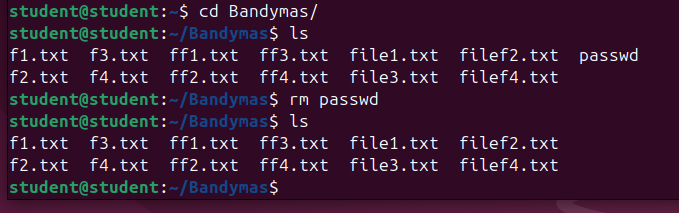

# Darbas su failais ir katalogais

1. Savo namų kataloge sukurkite katalogą Bandymas.

```
mkdir Bandymas
```


2. Kataloge Bandymas sukurkite failus: f1.txt, f2.txt, f3.txt, f4.txt, ff1.txt, ff2.txt, ff3.txt, ff4.txt. 

```
touch f1.txt f2.txt f3.txt f4.txt ff1.txt ff2.txt ff3.txt ff4.txt
```

3. Pažiūrėkite katalogo Bandymas turinį. 


4. Savo namų kataloge sukurkite katalogą Tikslas. 


5. Nukopijuokite katalogo Bandymas failus f1.txt, f3.txt, ff2.txt, ff4.txt į katalogą Tikslas. 

```
cp f1.txt f3.txt ff2.txt ff4.txt ~/Tikslas/
```

6. Pažiūrėkite katalogo Tikslas turinį. 


7. Katalogo Tikslas failų vardus pakeiskite iš f*.txt į file*.txt. 

```
mv f1.txt file1.txt
mv f3.txt file3.txt
mv ff2.txt filef2.txt
mv ff4.txt filef4.txt
```


8. Perkelkite pervadintus failus į katalogą Bandymas.

```
mv f*.txt ~/Bandymas
```


9.  Nukopijuokite failą passwd iš katalogo /etc į katalogą Bandymas. 

```
cp passwd ~/Bandymas/
```


10. Išveskite failo passwd turinį į ekraną. 

```
cat passwd
```


11.  Suraskite faile passwd žodį root. Rezultatą išveskite į ekraną. 

```
grep root passwd
```


12.  Suskaičiuokite kiek yra simbolių faile passwd.  

```
wc -m passwd
```


    
13.  Išveskite į ekraną failo passwd 5 pirmas ir paskutines failo eilutes. 

```
head -n 5 passwd
tail -n 5 passwd
```
    


14.  Kataloge Tikslas sukurkite failo passwd simbolinę nuorodą. 

```
ln -s passwd ~/Tikslas
```

15.  Pažiūrėkite katalogo Tikslas turinį. 
   


16.   Kataloge Bandymas ištrinkite failą passwd. 
    
```
rm passwd
```



17.  Pažiūrėkite katalogo Tikslas turinį. 

    

18.  Nukopijuokite failą fstab iš katalogo /etc į katalogą Tikslas. 

```
cp fstab ~/Tikslas
```

  

19.  Patikrinkite koks yra failo fstab dydis (baitais). 
    
```
wc -c fstab
```

  

20.  Kataloge Bandymas sukurkite failą sorting.txt su tokiomis eilutėmis: apples, oranges, pears, kiwis, bananas. 
    
```
nano sorting.txt
```

ctrl + O to save, Enter, ctrl + X to exit

 

21.  Surūšiuokite failo sorting.txt turinį (eilutes) pagal abėcėlę ir rezultatą išveskite į ekraną. 
    
```
sort sorting.txt
```

 

22.  Raskite, kur Jūsų failų sistemoje yra failas ff2.txt

```
find ~/ -name ff2.txt
```

 
