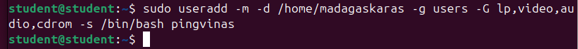
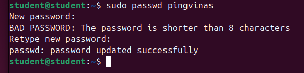
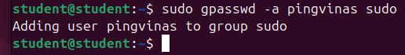
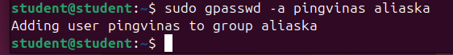
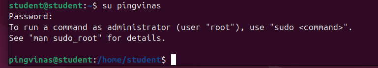
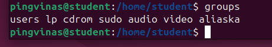
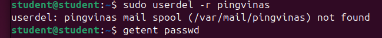
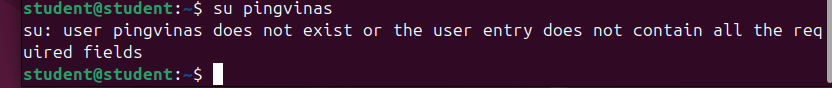

# Darbas su vartotojais

1. Sukurkite naują Linux OS vartotoją vardu pingvinas (suteikite jam namų katalogą vardu madagaskaras, priskirkite namų grupę users ir papildomas grupes lp,video,audio,cdrom bei nustatykite vartotojo shell apvalkalą bash). 

```
sudo useradd -m -d /home/madagaskaras -g users -G lp,video,audio,cdrom -s /bin/bash pingvinas
```



2. Suteikite vartotojui slaptažodį pingo. 

```
sudo passwd pingvinas
```



3. Pridėkite sukurtą vartotoją prie administravimo grupės – sudo. 

```
sudo gpasswd -a pingvinas sudo
```



or

```
sudo usermod -aG sudo pingvinas
```

4. Sukurkite naują vartotojų grupę aliaska. 

```
sudo groupadd aliaska
```

5. Pridėkite vartotoją pingvinas prie grupės aliaska. 

```
sudo gpasswd -a pingvinas aliaska
```



6. Prisijunkite prie Linux OS vartotojo pingvinas vardu. 

```
su pingvinas
```



7. Patikrinkite kokioms grupės priklauso sukurtas vartotojas pingvinas. 

```
groups
```



or 

```
groups pingvinas
```

or

```
id pingvinas
```

8. Pašalinkite vartotoją pingvinas iš Linux OS (kartu su vartotojo namų katalogu ir visa kita vartotojo informacija).

```
sudo userdel -fr pingvinas
```


