# Darbas su failų/katalogų prieigos teisėmis

1. Savo namų kataloge sukurkite katalogą Teises. 

```bash
mkdir Teises
```

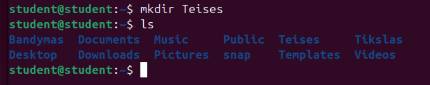

2. Kataloge Teises sukurkite failus: right1.txt, right2.txt, right3.txt. 

```bash
touch right1.txt right2.txt right3.txt
```

or

```bash
touch right{1..3}.txt
```

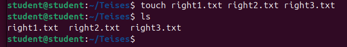

3. Pažiūrėkite katalogo Teises ir sukurtų failų prieigos teises. 

```bash
ls -la
```

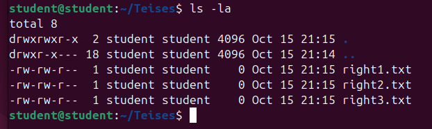
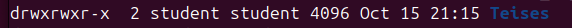

4. Pakeiskite katalogo Teises grupę į root grupę. 

```bash
sudo chown student:root ~/Teises
```

5. Pažiūrėkite katalogo Teises ir sukurtų failų prieigos teises. 

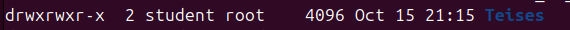
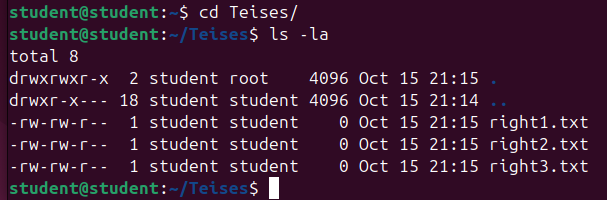

6. Sukurkite namų kataloge naują katalogą TeisesCP. 

```bash
mkdir TeisesCP
```

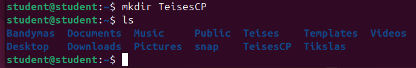

7. Nukopijuokite iš katalogo Teises failą right2.txt į katalogą TeisesCP. 

```bash
cp right2.txt ~/TeisesCP
```

8. Pažiūrėkite nukopijuoto failo prieigos teises. 

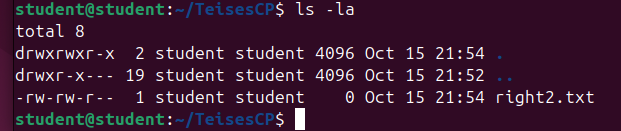

9.  Pakeiskite failo TeisesCP/right2.txt prieigos teises į 644. 

```bash
chmod 644 right2.txt
```

10. Pažiūrėkite failo TeisesCP/right2.txt prieigos teises. 

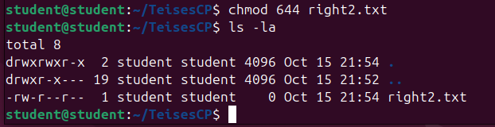

11.  Pakeiskite failo TeisesCP/right2.txt šeimininką į root. 

```bash
sudo chown root right2.txt
```

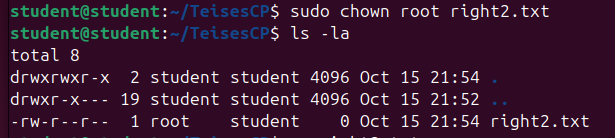

or to change owner and group:

```bash
sudo chown root:root right2.txt
```

12.  Ištrinkite (kaip paprastas vartotojas) failą TeisesCP/right2.txt.

```bash
rm right2.txt
```

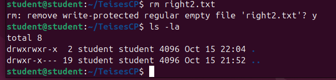