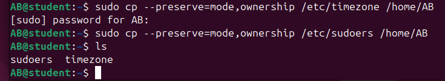
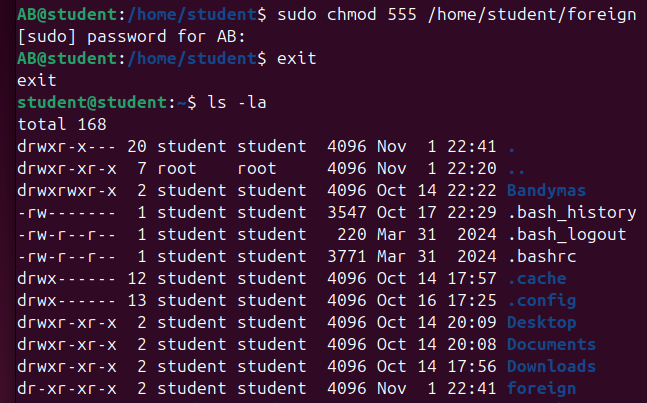
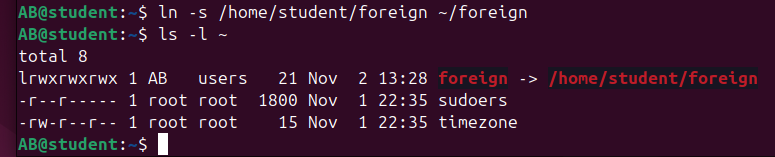
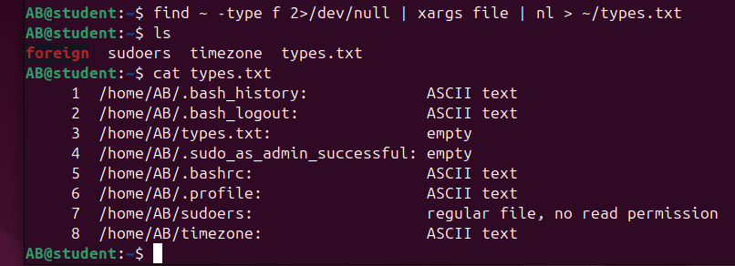
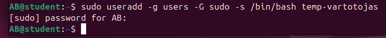
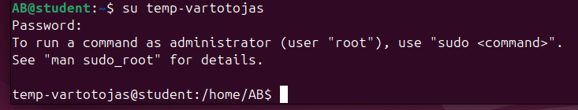
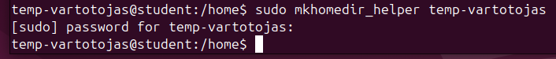
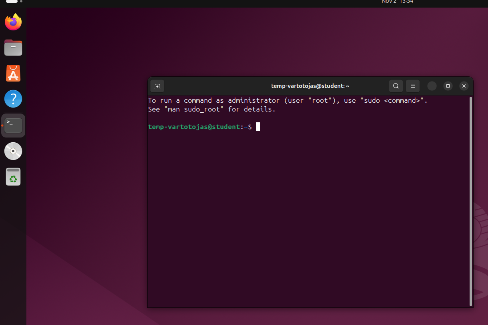

# Darbas su vartotojais ir teisemis

1. Sukurkite naują vartotoją VP, (VP - Jūsų vardo ir pavardės pirmos raidės), turintį namų katalogą, administratoriaus teises ir galintį peržiūrėti vaizdo įrašus, su slaptažodžiu kontrolinis. 

```bash
sudo useradd -m -g users -G sudo,video -s /bin/bash AB
sudo passwd AB
```


2. Patikrinkite, ar vartotojas VP buvo sukurtas. 

```bash
cat /etc/passwd
```


3. Atimkite iš vartotojo VP teises peržiūrėti vaizdo įrašus. Pažiūrėkite, kokioms grupėms priklauso VP. 

```bash
sudo gpasswd -d AB video
groups AB
```


4. Pridėkite vartotoją VP prie grupės party. 

```bash
sudo groupadd party
sudo gpasswd -a AB party
```


5. Prisijunkite prie sistemos kaip sukurtas vartotojas VP. 

```bash
su AB
```


6. Patikrinkite, kas prisijungęs prie sistemos ir koks vartotojas dabar dirba su terminalo langu. 

```bash
who
whoami
```


7. Savo namų kataloge sukurkite failus a ir b. Sukurkite katalogus A ir B. 

```bash
touch a b
mkdir A B
```


8. Perkelkite failą a į katalogą B. Nukopijuokite failą b į katalogą A. 

```bash
mv a.txt ~/B
cp b.txt ~/A
```


9. Ištrinkite kątik sukurtus katalogus ir failus. 

```bash
rm -r *
```


10. Nukopijuokite failus /etc/timezone ir /etc/sudoers su jų originaliomis teisėmis ir savininkais į savo namų katalogą. 

```bash
sudo cp --preserve=mode,ownership /etc/timezone /home/AB/
sudo cp --preserve=mode,ownership /etc/sudoers /home/AB/
```



11. Vartotojo student namų kataloge sukurkite katalogą foreign. Pakeiskite jo šeimininką ir grupę į student. 

```bash
sudo mkdir /home/student/foreign
sudo chown student:student /home/student/foreign
```

12. Pakeiskite sukurto katalogo foreign teises taip, kad visi sistemoje galėtų į jį įeiti, tačiau niekas negalėtų įrašyti. 

```bash
sudo chmod a+rx /home/student/foreign
sudo chmod a-w /home/student/foreign
# or 
sudo chmod 555 /home/student/foreign
```

before:


after:



13. Savo namų kataloge sukurkite katalogo foreign nuorodą. 

```bash
ln -s /home/student/foreign ~/foreign
# to check:
ls -l ~
```



14. Savo namų kataloge (ir jame esančiuose kataloguose) suraskite visus failus, nurodykite jų failų tipus ir sunumeruotą tokį sąrašą išsaugokite faile types.txt. Būsimas klaidas ignoruokite. (find, xargs, file) 

```bash
find ~ -type f 2>/dev/null | xargs file | nl > ~/types.txt
# find [kelias] [salygos]
# 2>/dev/null - paslepia klaidas
# | xargs file - perduoda visus rastus failus file komandai
# | nl - sunumeruoja eiles
# > ~/types.txt - issaugo rezultata types.txt faile
```



15. Sukurkite naują vartotoją “temp-vartotojas” tik su administratoriaus teisėmis (be namų katalogo). 

```bash
sudo useradd -g users -G sudo -s /bin/bash temp-vartotojas
```



16. Prisijunkite prie sistemos kaip sukurtas vartotojas.



17. Paredaguokite save taip, kad galėtumėte prisijungti prie grafinės aplinkos (usermod mkhomedir_helper). 

```bash
sudo mkhomedir_helper temp-vartotojas
```



18. Prisijunkite grafinėje aplinkoje. 

