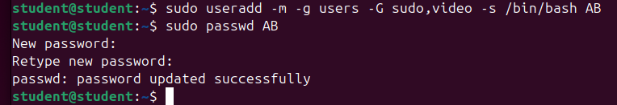
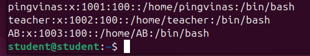
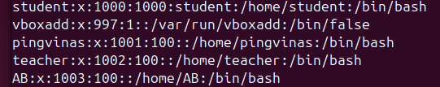
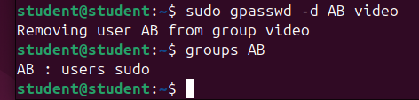
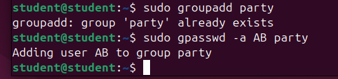
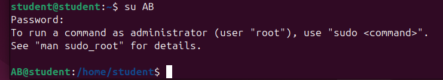
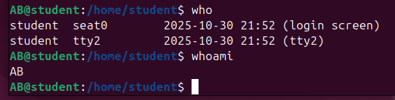
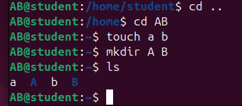
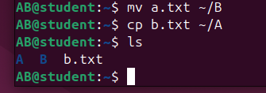
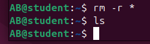

# Darbas su vartotojais ir teisemis

1. Sukurkite naują vartotoją VP, (VP - Jūsų vardo ir pavardės pirmos raidės), turintį namų katalogą, administratoriaus teises ir galintį peržiūrėti vaizdo įrašus, su slaptažodžiu kontrolinis. 

```
sudo useradd -m -g users -G lp,video,audio -s /bin/bash AB
sudo passwd AB
```



2. Patikrinkite, ar vartotojas VP buvo sukurtas. 



or

```
cat /etc/ passwd
```



3. Atimkite iš vartotojo VP teises peržiūrėti vaizdo įrašus. Pažiūrėkite, kokioms grupėms priklauso VP. 

```
sudo gpasswd -d AB video
groups AB
```



4. Pridėkite vartotoją VP prie grupės party. 

```
sudo groupadd party
sudo gpasswd -a AB party
```



5. Prisijunkite prie sistemos kaip sukurtas vartotojas VP. 

```
su AB
```



6. Patikrinkite, kas prisijungęs prie sistemos ir koks vartotojas dabar dirba su terminalo langu. 

```
whoami
```



7. Savo namų kataloge sukurkite failus a ir b. Sukurkite katalogus A ir B. 

```
touch a.txt b.txt
mkdir A B
```



8. Perkelkite failą a į katalogą B. Nukopijuokite failą b į katalogą A. 

```
mv a.txt ~/B
cp b.txt ~/A
```



9. Ištrinkite kątik sukurtus katalogus ir failus. 

```
rm -r *
```



10. Nukopijuokite failus /etc/timezone ir /etc/sudoers su jų originaliomis teisėmis ir savininkais į savo namų katalogą. 


Vartotojo student namų kataloge sukurkite katalogą foreign. Pakeiskite jo šeimininką ir grupę į student. 

Pakeiskite sukurto katalogo foreign teises taip, kad visi sistemoje galėtų į jį įeiti, tačiau niekas negalėtų įrašyti. 

Savo namų kataloge sukurkite katalogo foreign nuorodą. 

Savo namų kataloge (ir jame esančiuose kataloguose) suraskite visus failus, nurodykite jų failų tipus ir sunumeruotą tokį sąrašą išsaugokite faile types.txt. Būsimas klaidas ignoruokite. (find, xargs, file) 

Sukurkite naują vartotoją “temp-vartotojas” tik su administratoriaus teisėmis (be namų katalogo). 

Prisijunkite prie sistemos kaip sukurtas vartotojas. 

Paredaguokite save taip, kad galėtumėte prisijungti prie grafinės aplinkos (usermod mkhomedir_helper). 

Prisijunkite grafinėje aplinkoje. 