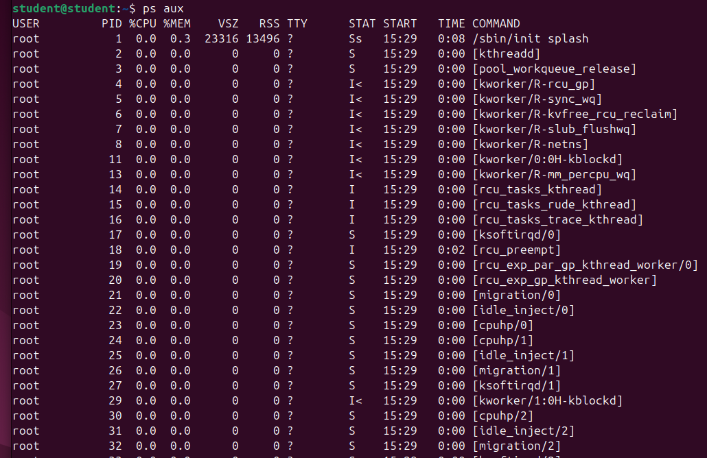
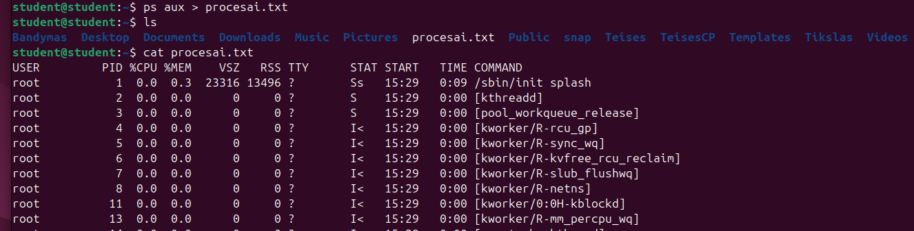
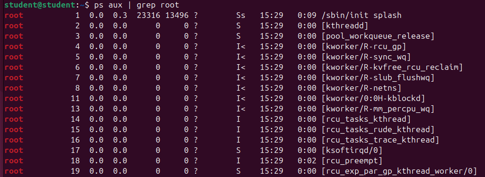
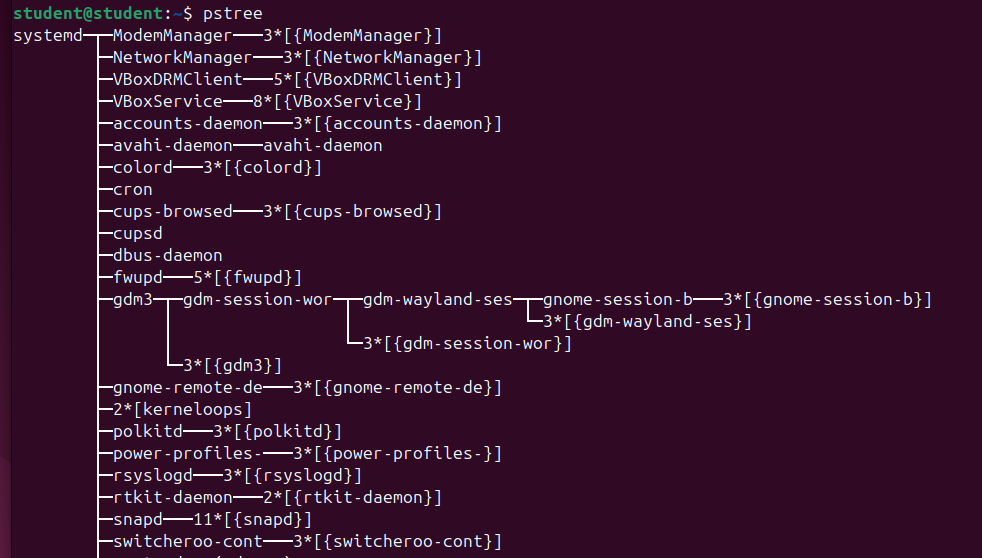
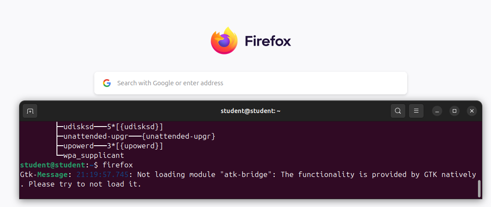
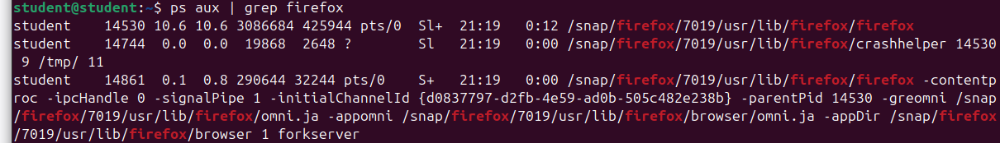
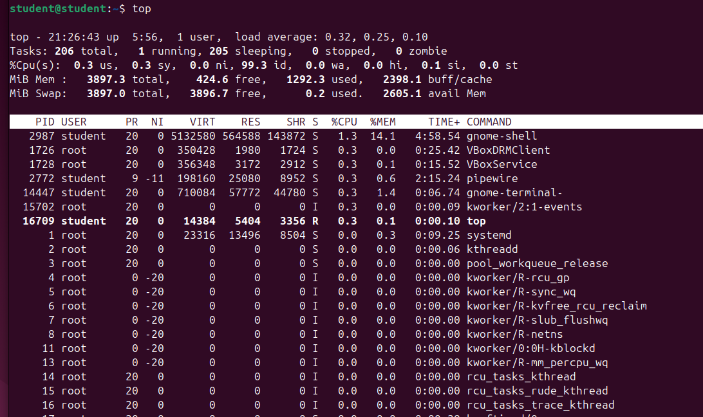
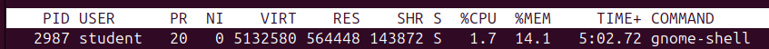
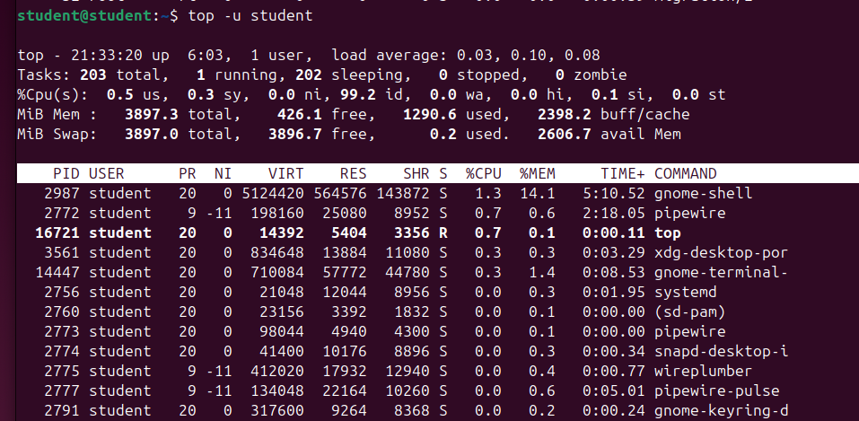
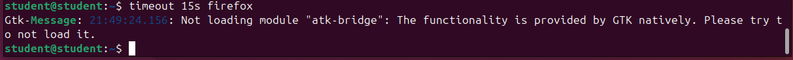

# Darbas su OS procesais

1. Išveskite į ekraną visus OS procesus. 

```
ps aux
```


2. Visų procesų sąrašą išsaugokite faile procesai.txt (vieta: ~).

```
ps aux > procesai.txt
```



3. Išveskite į ekraną visus vartotojo root procesus.

```
ps aux | grep root
```


4. Išbandykite komandą pstree.

```
pstree
```


5. Paleiskite Firefox interneto naršyklę (leisti iš komandinės eilutės).

```
firefox
```



6. Suraskite paleistą Firefox programą procesų sąraše.

```
ps aux | grep firefox
```



7. Uždarykite Firefox programą iš komandinės eilutės.

```
pkill firefox
```

8. Išbandykite komandą (programą) top.

```
top
```



9. top programos pagalba patikrinkite kokia programa (procesas) naudoja daugiausiai atminties (RAM).



10. Suraskite, kiek procesų šiuo metu priklauso jūsų vartotojui.

```
top -u student
```



11. Išfiltruokite visus „zombie“ tipo procesus.

```
ps aux | grep 'defunct'
```

or

```
ps aux | grep 'z'
```


12. Paleiskite bet kokią programą taip, kad ji automatiškai būtų nutraukta po 15 sekundžių.

```
timeout 15s firefox
```



13. Užblokuokite savo naudotojui galimybę paleisti tam tikrą programą/komandą

