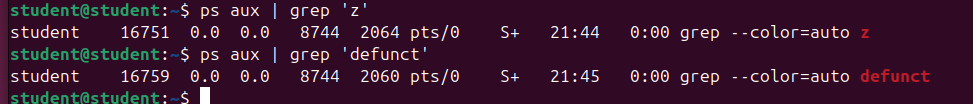
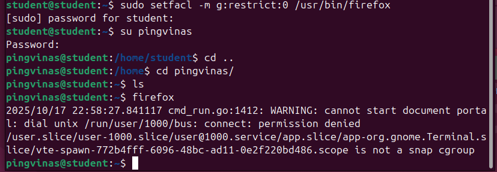
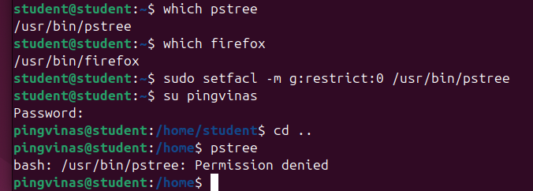

# Darbas su OS procesais

1. Išveskite į ekraną visus OS procesus. 

```
ps aux
```


2. Visų procesų sąrašą išsaugokite faile procesai.txt (vieta: ~).

```
ps aux > procesai.txt
```


3. Išveskite į ekraną visus vartotojo root procesus.

```
ps aux | grep root
```


4. Išbandykite komandą pstree.

```
pstree
```


5. Paleiskite Firefox interneto naršyklę (leisti iš komandinės eilutės).

```
firefox
```


6. Suraskite paleistą Firefox programą procesų sąraše.

```
ps aux | grep firefox
```


7. Uždarykite Firefox programą iš komandinės eilutės.

```
pkill firefox
```

8. Išbandykite komandą (programą) top.

```
top
```


9. top programos pagalba patikrinkite kokia programa (procesas) naudoja daugiausiai atminties (RAM).


10. Suraskite, kiek procesų šiuo metu priklauso jūsų vartotojui.

```
top -u student
```


11. Išfiltruokite visus „zombie“ tipo procesus.

```
ps aux | grep 'defunct'
```

or

```
ps aux | grep 'z'
```



12. Paleiskite bet kokią programą taip, kad ji automatiškai būtų nutraukta po 15 sekundžių.

```
timeout 15s firefox
```


13. Užblokuokite savo naudotojui galimybę paleisti tam tikrą programą/komandą

- make sure the user exits (the one you want to block access to)
- add a group (the one you want to apply the restrictions to):

```
sudo groupadd groupname
```

- add user to the group:
```
sudo usermod -aG groupname username
```

a - append (don't remove from other groups);
G - specify groups

- make sure you're running commands as the root/main user
- limit program access:

```
sudo setfacl -m g:groupname:0 /usr/bin/firefox
```

setfacl - set file access control list (ACLs); m - modify; g - target group; 0 - no permissions at all



- to block a command:
- easy way to see which path it belongs:
```
which command
```
- then the same command applies:
```
sudo setfacl -m g:restrict:0 /usr/bin/pstree
```

