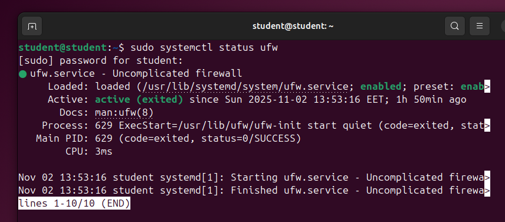

# Darbas su OS procesais




1.  Patikrinkite ufw tarnybos būsena. Išveskite jos visus log’sus.
   
```
sudo systemctl status ufw
```

for logs:

```
sudo journalctl -u ufw
```

2.  Patikrinkite, ar ufw tarnyba veikia sistemoje, ir jei neveikia – ją paleiskite.
   
```
sudo systemctl start ufw
```

or

```
sudo systemctl enabled ufw
```

3. Patikrinkite, kurios tarnybos neveikia.
   
```
systemctl list-units --type=service --state=inactive
```

4. Išveskite visas sistemos tarnybas.

```
systemctl list-units --type=service
```

5. Išjunkite tarnybos openvpn automatinį paleidimą. Perkraukite sistemą ir patikrinkite ar tarnyba openvpn veikia.

```
sudo systemctl disable openvpn
```

6. Patikrinkite ar turite ssh tarnybą. Jei ne, įdiekite ir paleiskite. Patikrinkite jos log’sus, įsitikinkite, kad nėra paleisties klaidų.

```
sudo systemctl status ssh
```

to install:
```
sudo apt install openssh-server
```

check logs:
```
sudo systemctl status ssh
```

```
systemctl list-units -all --type=service | grep ssh
```