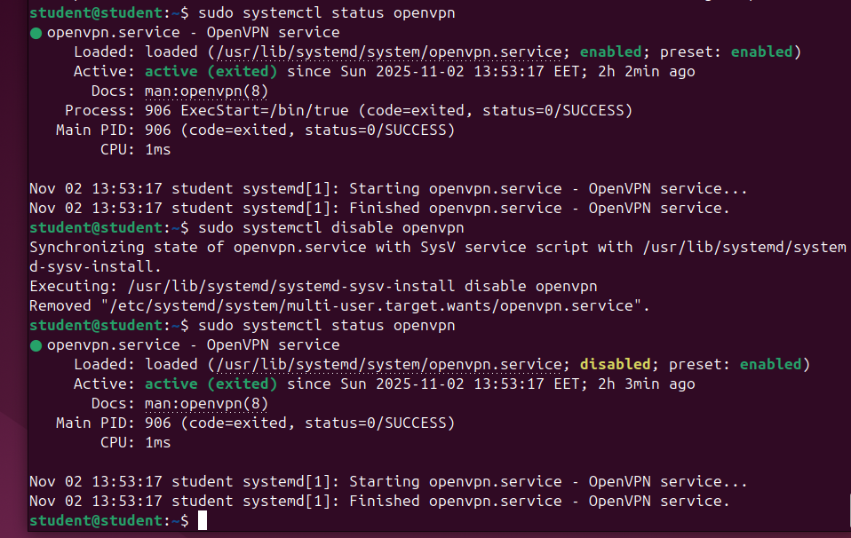
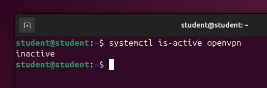

# Darbas su OS procesais

1.  Patikrinkite ufw tarnybos būsena. Išveskite jos visus log’sus.
   
```bash
sudo systemctl status ufw
```


for logs:

```bash
sudo journalctl -u ufw
```


2.  Patikrinkite, ar ufw tarnyba veikia sistemoje, ir jei neveikia – ją paleiskite.

```bash
# to check if active:
systemctl is-active ufw
# to start it:
sudo systemctl start ufw
```


3. Patikrinkite, kurios tarnybos neveikia.
   
```bash
systemctl list-units --type=service --state=inactive
```


4. Išveskite visas sistemos tarnybas.

```bash
systemctl list-units --type=service
```


5. Išjunkite tarnybos openvpn automatinį paleidimą. Perkraukite sistemą ir patikrinkite ar tarnyba openvpn veikia.

```bash
sudo systemctl disable openvpn
```



after rebooting:



6. Patikrinkite ar turite ssh tarnybą. Jei ne, įdiekite ir paleiskite. Patikrinkite jos log’sus, įsitikinkite, kad nėra paleisties klaidų.

```bash
sudo systemctl status ssh
```


to install:
```bash
sudo apt install openssh-server
```

to start the service:
```bash
sudo systemctl start ssh
```

check logs:
```bash
sudo systemctl status ssh
# or for full logs:
sudo journalctl -u ssh›
```


```bash
systemctl list-units -all --type=service | grep ssh
```


### **Errors Encountered**

Was having huge issues for my VM connecting to the internet. Even when I changed the settings of my VM. So what worked:

```bash
# Manually configure the network interface:
sudo nano /etc/netplan/01-network-manager-all.yaml

# Add this configuration:
network:
  version: 2
  renderer: NetworkManager
  ethernets:
    enp0s8:
      dhcp4: yes

# Then apply changes with:
sudo netplan apply
```