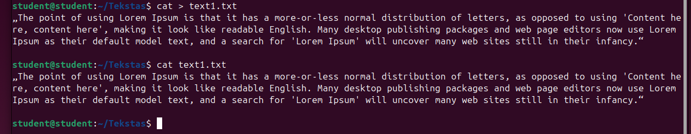
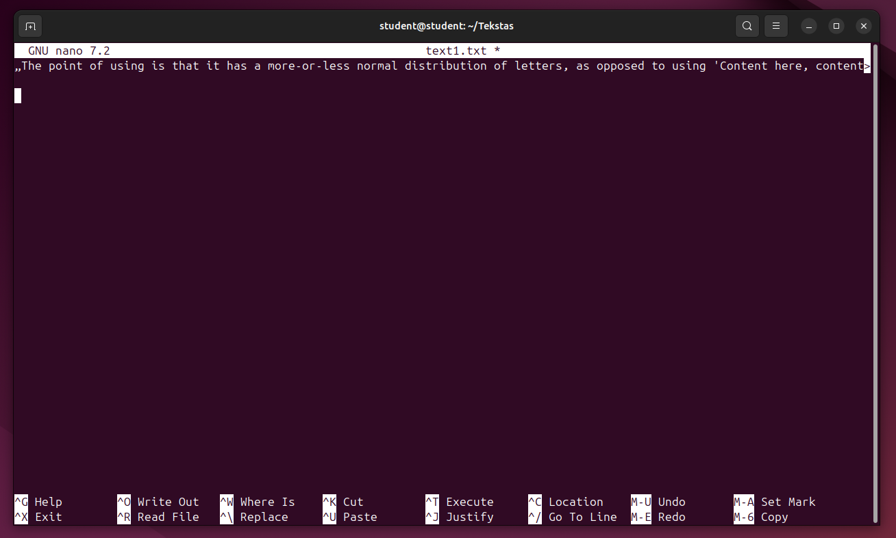
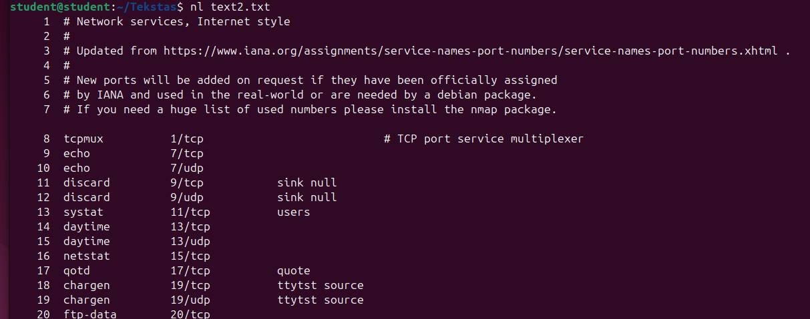
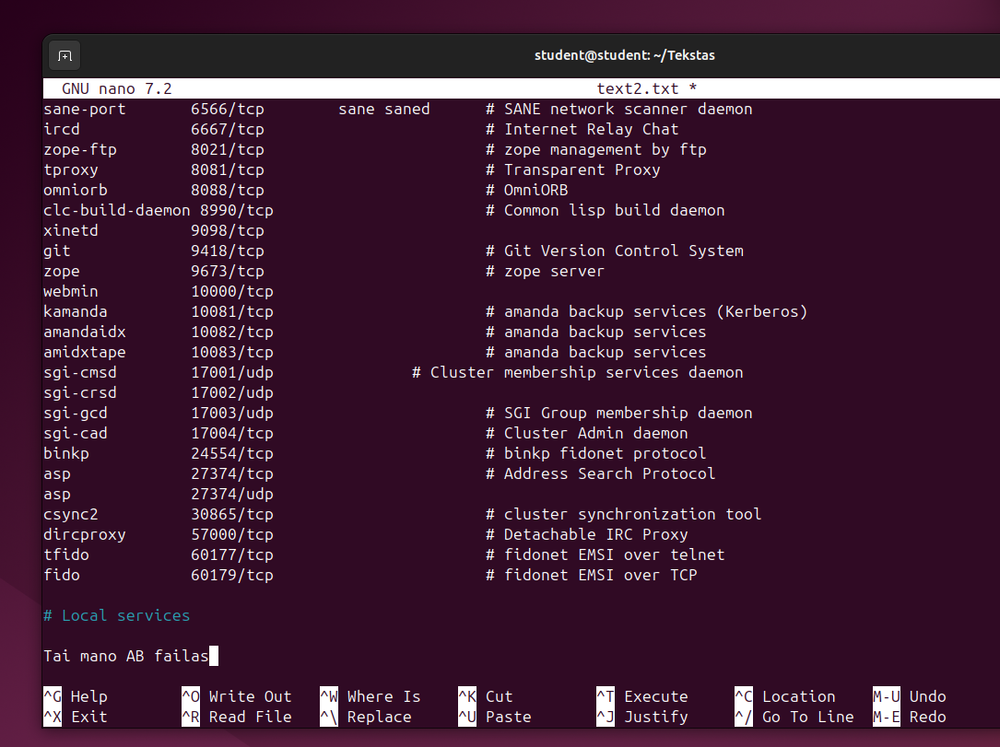
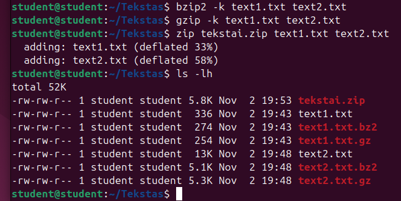
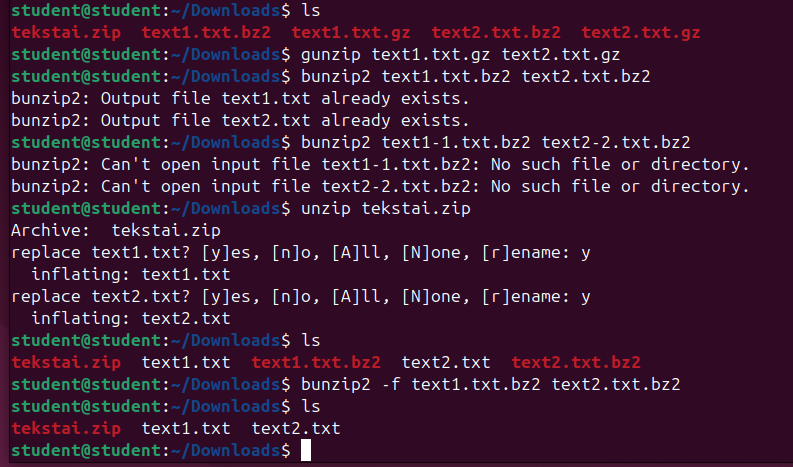
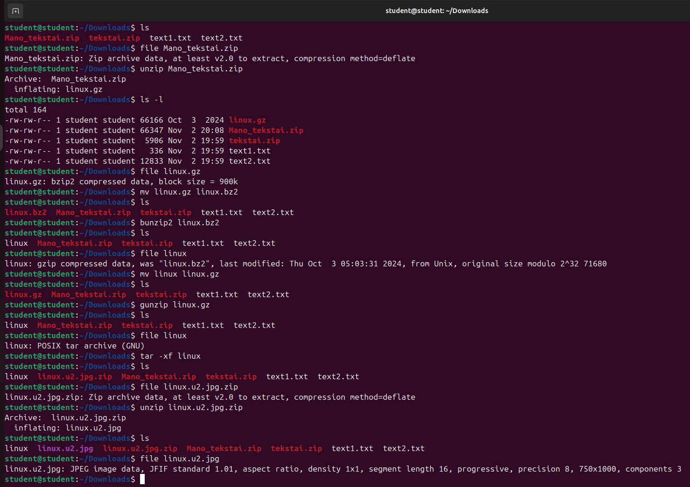

# DARBAS SU TEKSTO REDAKTORIAIS, ARCHYVATORIAIS IR KOMANDINĖS EILUTĖS FAILŲ TVARKYTUVĖ MC

**Tikslas:** išmokti kurti ir redaguoti failus komandinės eilutės teksto redaktorių vim ir nano pagalba, glaudinti (archyvuoti) failus katalogus tar, gzip, bzip, unrar programų pagalba.

**Reikalavimai:** darbas vykdomas komandinėje eilutėje. Grafinė Linux OS aplinka (GUI) gali būti naudojama tik rezultatams patikrinti. 

1. Susipažinkite su nano ir vim tekstinių redaktorių galimybėmis. Tam naudokite standartinę Linux OS pagalbą. Taip pat norint išmokti dirbti su vim teksto redaktoriumi galite naudoti vimtutor programą. 

2. Sukurkite savo namų kataloge katalogą Tekstas, o jame failus: text1.txt, text2.txt. 

```bash
mkdir Tekstas
touch txt1.txt text2.txt
```


3. Nenaudojant tekstinio redaktoriaus įrašykite į failą text1.txt tekstą: „The point of using Lorem Ipsum is that it has a more-or-less normal distribution of letters, as opposed to using 'Content here, content here', making it look like readable English. Many desktop publishing packages and web page editors now use Lorem Ipsum as their default model text, and a search for 'Lorem Ipsum' will uncover many web sites still in their infancy.“

```bash
cat > text.txt
# paste the text
# ctrl + D
```



4. Naudojant vim arba nano teksto redaktorius ištrinkite visus žodžius „Lorem Ipsum“ iš failo text1.txt. 

```bash
nano text1.txt
```



5. Nukopijuokite failo /etc/services turinį į failą text2.txt. 

```bash
cp /etc/services ~/Tekstas/text2.txt
```

6. Sunumeruokite visas failo text2.txt eilutes. 

```bash
nl text2.txt
```



7. Naudojant vim arba nano teksto redaktorius pridėkite failo text2.txt pabaigoje tekstą „Tai mano Vardas Pavardė failas“, kur vardas, pavardė yra Jūsų inicialai. 

```bash
nano text2.txt
```



8. Suarchyvuokite failus text1.txt ir text2.txt archyvatoriais bzip2, zip ir gzip. Išveskitę gautų archyvų dydžius.

```bash
bzip2 -k text1.txt text2.txt
gzip -k text1.txt text2.txt
zip tekstai.zip text1.txt text2.txt
ls -lh
```



9.  Katalogę Downloads išarchyvuokite failus text1.txt ir text2.txt.

```bash
cp ~/Tekstas/*.gz ~/Tekstas/*.bz2 ~/Tekstas/*.zip ~/Downloads/
# gzip:
gunzip text1.txt.gz text2.txt.gz
# bzip2 using -f force overwrite:
bunzip2 -f text1.txt.bz2 text2.txt.bz2
# zip:
unzip tekstai.zip
```



10. Atsisiųskite Teams užduotyse esantį archyvą Mano_tekstai.zip. Išarchyvuokite gautą archyvą ir patikrinkite jo turinį. Galutinis failas turėtu būti paveikslėlis.

```bash
unzip Mano_tekstai.zip
file linux.gz
# format is bzip2 so change the name:
mv linux.gz linux.bz2
bunzip2 linux.bz2
file linux
# it's a gzip format so change the name:
mv linux linux.gz
gunzip linux.gz
file linux
# tar archive:
tar -xf linux
file linux.u2.jpg.zip
unzip linux.u2.jpg.zip
# JPEG format finally!
```

