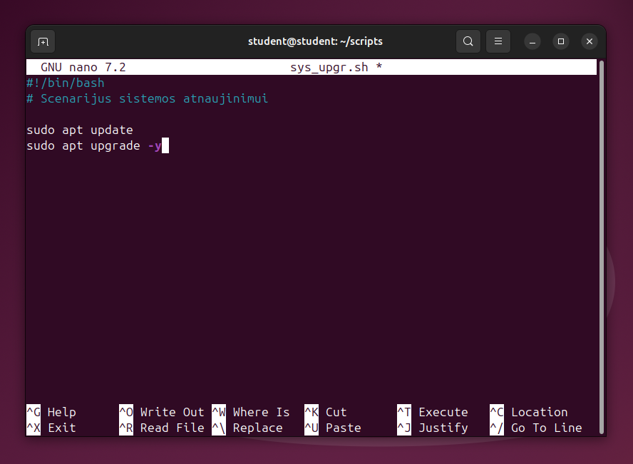
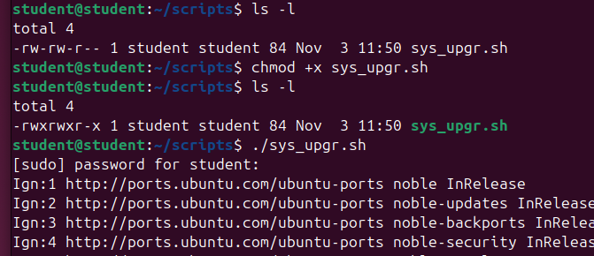
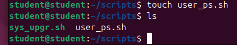
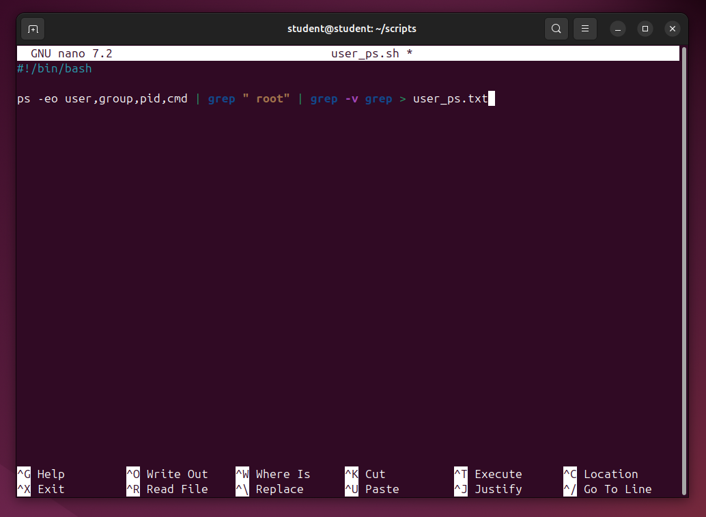
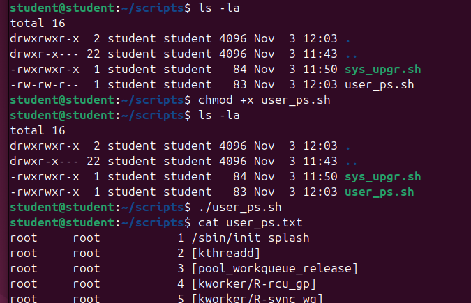

# BASH SCENARIJAI

**Tikslas:** išmokti nagrinėti ir rašyti trumpus bash scenarijus. 

**Reikalavimai:** darbas vykdomas komandinėje eilutėje. Grafinė Linux OS aplinka (GUI) gali būti naudojama tik rezultatams patikrinti. 

1. Savo namų kataloge sukurkite katalogą scripts. 

```bash
mkdir scripts
```


2. Kataloge scripts sukurkite naują scenarijaus failą vardu sys_upgr.sh. 

```bash
touch sys_upgr.sh
```

3. Parašykite scenarijų, kuris atnaujintų Jūsų sistemą. (apt update; apt upgrade)



4. Išbandykite parašytą scenarijų sys_upgr.sh. 

```bash
chmod +x sys_upgr.sh
./sys_upgr.sh
```



5. Kataloge scripts sukurkite naują scenarijaus failą vardu user_ps.sh. 

```bash
touch user_ps.sh
```



6. Parašykite scenarijų, kuris įrašytų į failą user_ps.txt visus grupei root priklausančius vykdomus sistemos procesus. 

```bash
#!/bin/bash
ps -eo user,group,pid,cmd | grep " root" | grep -v grep > user_ps.txt
```



7. Išbandykite parašytą scenarijų user_ps.sh. 

```bash
chmod +x user_ps.sh
./user_ps.sh
```



8. Pažiūrėkite failo user_ps.txt turinį.

```bash
cat user_ps.txt
```

9.  Parašykite scenarijų, kuris sukurtų naują vartotoją jūsų pasirinktu vardu ir prisijungtu prie jo.


*10. Papildykite 9-to punkto scenarijų taip, kad vartotojo vardą būtu galima įrašyti paleidus scenarijų.

*11. Parašykite scenarijų, kuris paverstu jūsų pasirinktą katalogą ir jame esančius failus prieinamus ir naudojamus tik root vartotojui (savininkas bei grupė root, teisės tik root vartotojui).

*12. Papildykite 11-to punkto scenarijų taip, kad katalogą būtu galimą įrašyti paleidus scenarijų.

*13. Parašykite scenarijų, kuris pasisveikintu su vartotoju jo vardu (naudokite read).