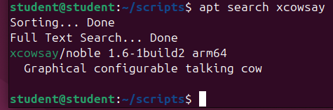
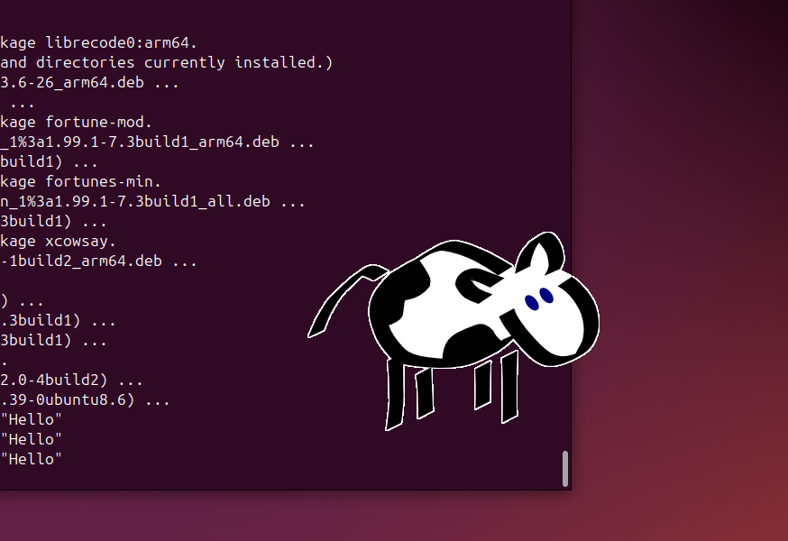

# PAKETŲ VALDYMAS. PAKETŲ KONCEPTŲ SUPRATIMAS IR VALDYMAS

**Tikslas:** išmokti surasti, įdiegti, pašalinti reikiamą programinį paketą, įdiegti bei pašalinti PPA.

**Reikalavimai:** darbas vykdomas komandinėje eilutėje. Grafinė Linux OS aplinka (GUI) gali būti naudojama tik rezultatams patikrinti. 

1. Su apt įrankiu suraskite programinį paketą xcowsay. 

```bash
apt search xcowsay
```



2. Su apt įrankiu įdiekite paketą į sistemą. Išbandykite paketo veikimą.

```bash
sudo apt update
sudo apt install xcowsay -y
xcowsay "Hello"
```



3. Internete suraskite programinį paketą su plėtiniu deb.


4. Su dpkg įrankiu įdiekite surastą paketą į sistemą. Išbandykite paketo veikimą.

5. Naudojant savo pasirinktą įrankį įdiekite programą neofetch. 

6. Išbandykite programos veikimą.

7. Naudojant savo pasirinktą įrankį įdiekite programą Visual Studio Code.

8. Su apt įrankiu pašalinkite pasirinktą paketą iš sistemos.

9.  Raskite būdą kaip instaliuoti paketą fastfetch ir įdiekite jį.

*10. Įdiekite programą cockpit. Įgalinkite jos suteiktą tarnybą ir išbandykite.

*11. Įdiekite programą btop iš išeities kodo (žiūrėti sekciją „With make“).  Išbandykite programos veikimą.

*12. Išsirinkite dvi programas iš šio sąrašo ir įdiekite jas iš išeities kodo pagal instrukciją.
*13. Įsidiekite Fedora linux ir pakartokite šiuos punktus (apt, dpkg atvėju naudokite Fedora analogą dnf).