# Operacines Sistemos - Kontrolinis

**Reikalavimai:** Kiekvieno punkto atsakymas pateikiamas ekrano atvaizdo (screenshot) formatu pavadinimu uzd_numeris (uzd_1, uzd_2 ir t.t.). Kiekvienam punktui daromas atskiras ekrano atvaizdas. Punktai atliekami Ubuntu OS komandinėje eilutėje. Punktas gali būti atliktas keliomis komandomis. Atsakymus, suspaustus į archyvą VardasPavarde.zip, prisegate prie užduoties. Galite pateikti ir Word variantą (tokiu pat formatu, kaip užduotys).
Visi punktai verti 1 taško, išskyrus 15 (2 taškai),  17 (3 taškai). Viso 21 taškai.

1. Sukurkite sistemoje naują vartotoją, vardu laikymasVP (VP - jūsų vardo ir pavardės pirmosios raidės). Priskirkite jam namų katalogą vardu laikymas, priskirkite pagrindinę grupę users ir papildomas teises audio ir video. Priskirkite interpretatorių bash.

```bash
sudo useradd -m -d /home/laikymas -g users -G audio,video -s /bin/bash laikymasAB
sudo passwd laikymasAB
```

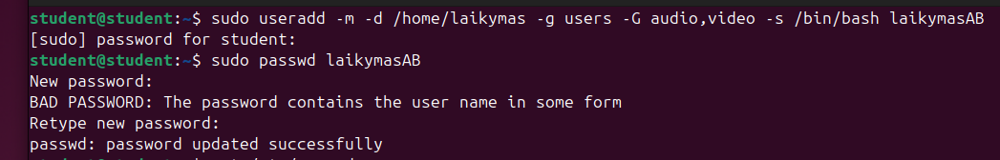

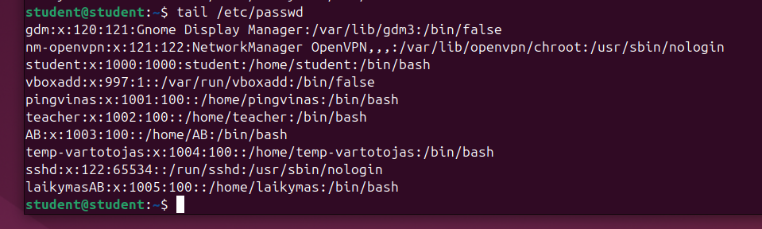

2. Atimkite iš vartotojo teises klausytis garsų. Pridėkite administratoriaus teises.

```bash
sudo gpasswd -d laikymasAB audio
sudo adduser laikymasAB sudo
groups laikymasAB
```

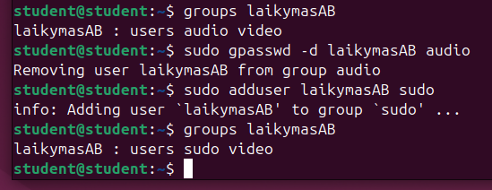

3. Prisijunkite prie sistemos kątik sukurtu vartotoju.

```bash
su laikymasAB
```

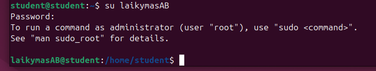

4. Savo (laikymasVP) namų kataloge sukurkite katalogus rytas ir vakaras. Sukurkite failus labas ir viso.

```bash
mkdir rytas vakaras
touch labas viso
```

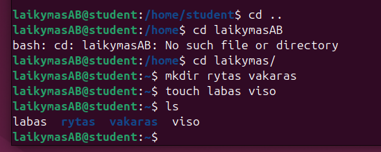

5. Nukopijuokite failus labas ir viso į katalogą rytas. Visą katalogo rytas turinį perkelkite į katalogą vakaras.

```bash
cp labas ~/rytas
cp viso ~/rytas
mv ~/rytas/* ~/vakaras
```

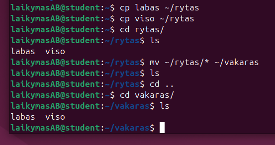

6. Ištrinkite 5-ame punkte sukurtus failus ir katalogus.

```bash
rm -r /home/laikymas/*
```

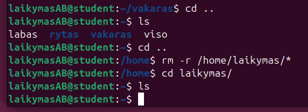

7. Išveskite į ekraną visus OS procesus. Visų procesų sąrašą išsaugokite faile proc.txt (vieta: ~/Desktop).

```bash
ps aux
mkdir Desktop
ps aux > proc.txt
```

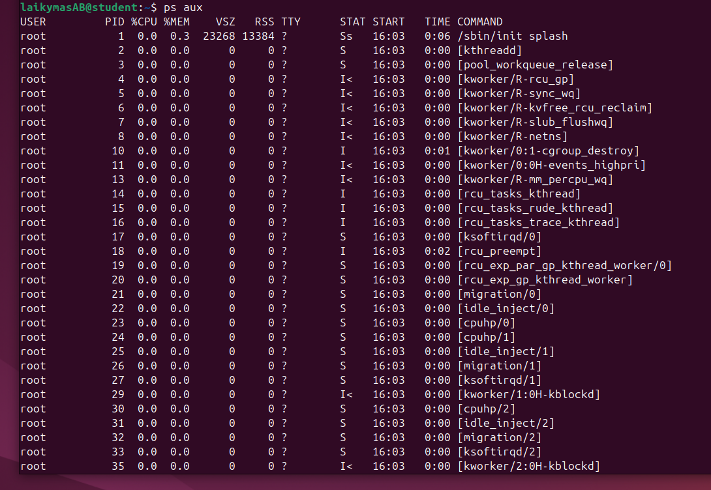

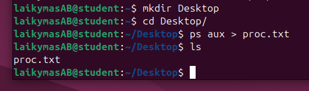

8. Išveskite į ekraną visus esamo vartotojo procesus. Vartotojo procesų sąrašą išsaugokite faile procu.txt (vieta ~/Desktop).

```bash
ps aux | grep laikymasAB
ps aux | grep laikymasAB > procu.txt
```

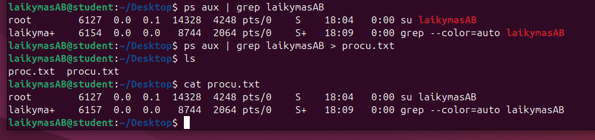

9.  Failo procu.txt gale naudodamiesi pasirinktu teksto redaktoriumi pridėkite tekstą: "Čia mano Vardas Pavardė procesai".

```bash
nano procu.txt
cat procu.txt
```

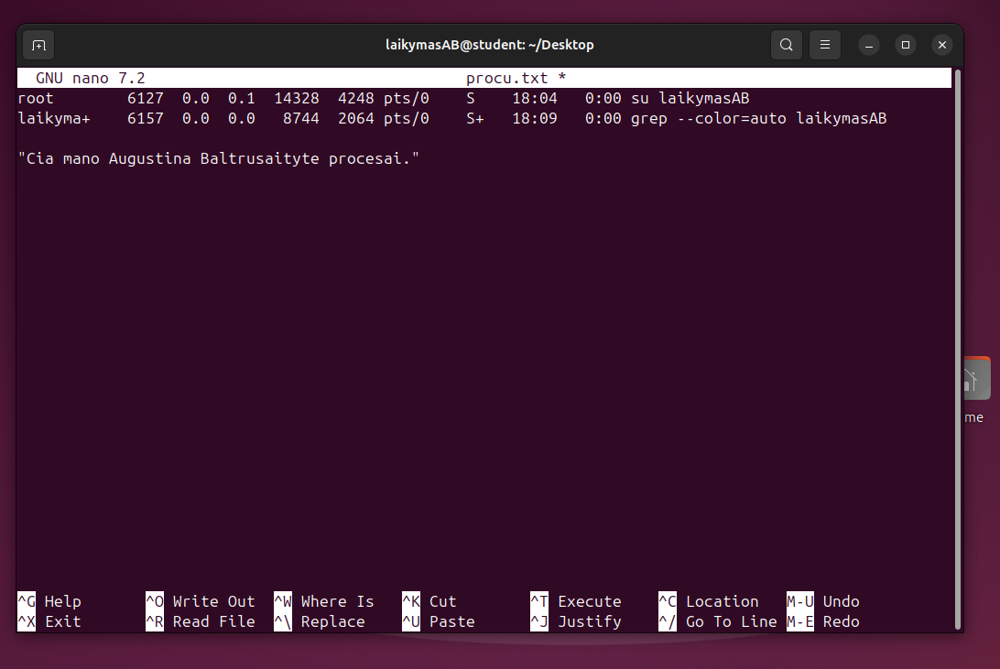

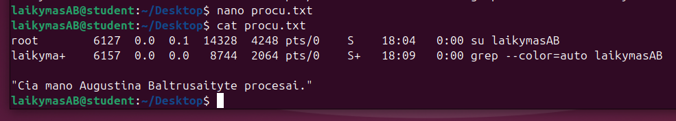

10. Failus proc.txt ir procu.txt sudėkite į archyvą vardu proc.zip. Išveskite, kokio tipo yra failas proc.zip.

```bash
zip proc.zip proc.txt procu.txt
file proc.zip
```

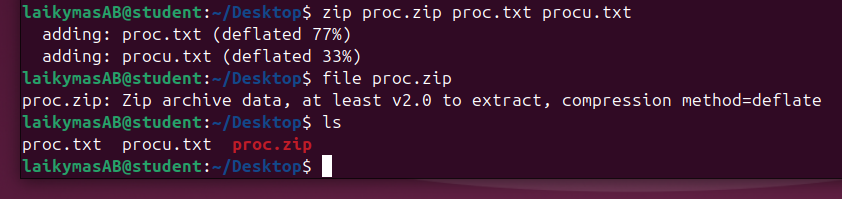

11. Suteikite vartotojui student (arba jūsų pradinis vartotojas) teisę paleisti (execute) failą proc.zip.

```bash
setfacl -m u:student:x myfolder
```

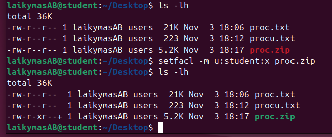

12. Pažiūrėkite, kokias teises turite failui /bin/ls.

```bash
ls -l /bin/ls
```

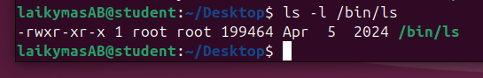

13. Kataloge /home suraskite visus failus, susijusius su žodžiu "mozilla".

```bash
find / -name "mozilla" 2> /dev/null
```

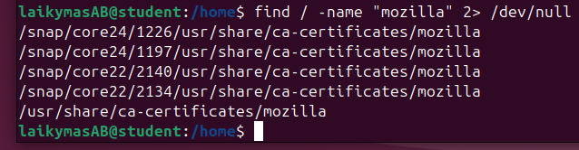

14. Patikrinkite, ar sistemoje turite "zombinių" procesų.

```bash
ps aux | grep 'z'
```

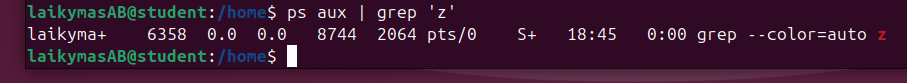

15. Parašykite scenarijų, kuris suskaičiuoja visus Jūsų namuose esančius failus (įskaitant katalogų viduj esančius) ir išveda tą skaičių.

```bash
touch count_files.sh

#!/bin/bash
ls /home | wc -l

./count_files.sh
```

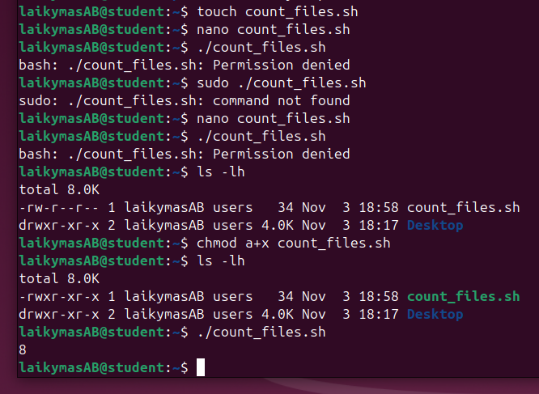

16. Prisijunkite prie Ubuntu OS naudodamiesi SSH klientu savo Host OS.

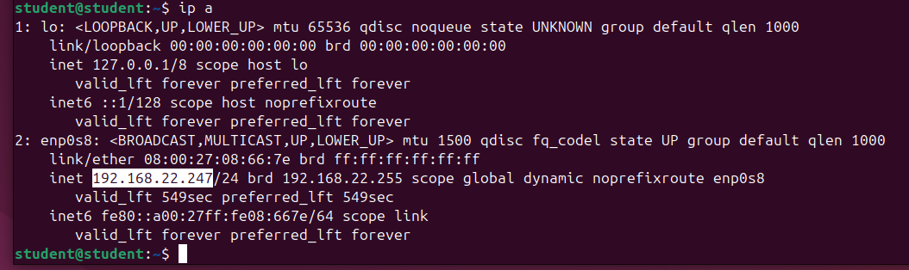

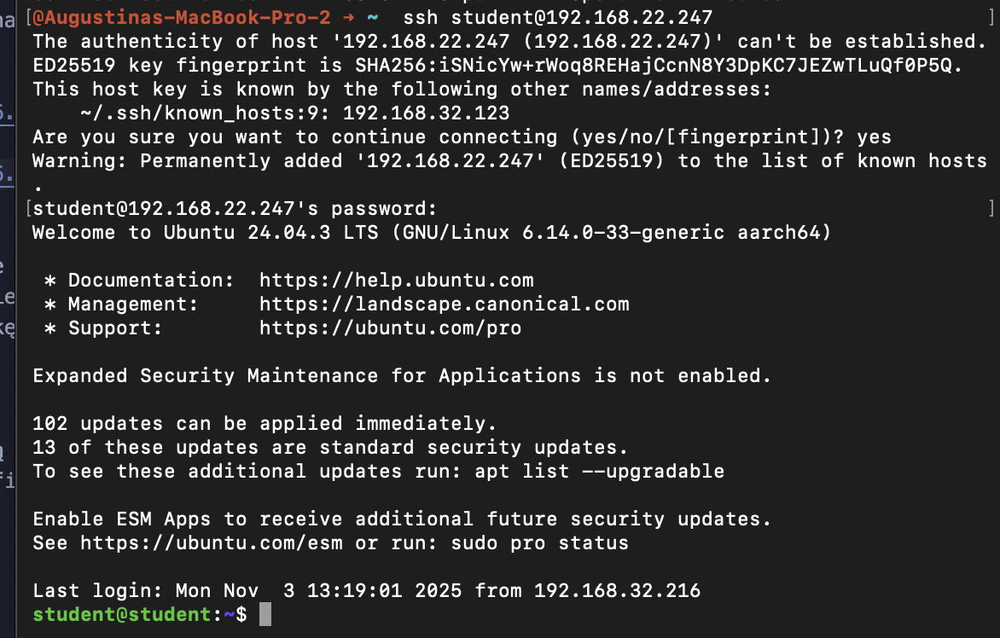


17. Host OS SSH įrankiu sukurkite naują Apache WEB serverio tipo tinklalapį. Jį pasiekti naudokite domeną. Puslaptio turinys - “Sveiki atvykę į mano puslapį.”

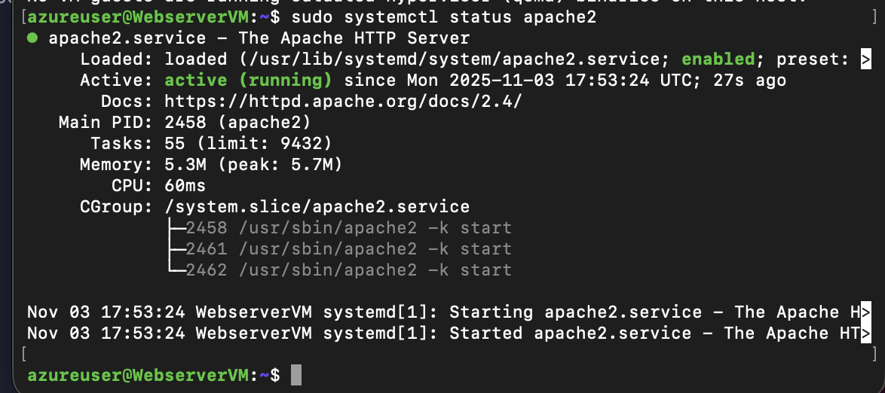

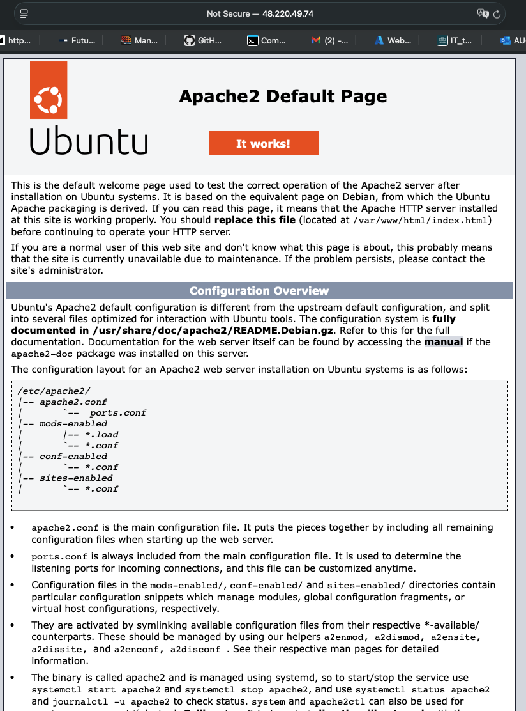

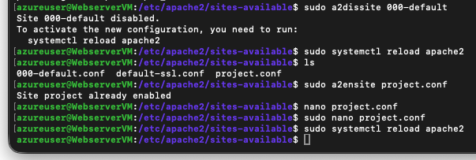

And after:

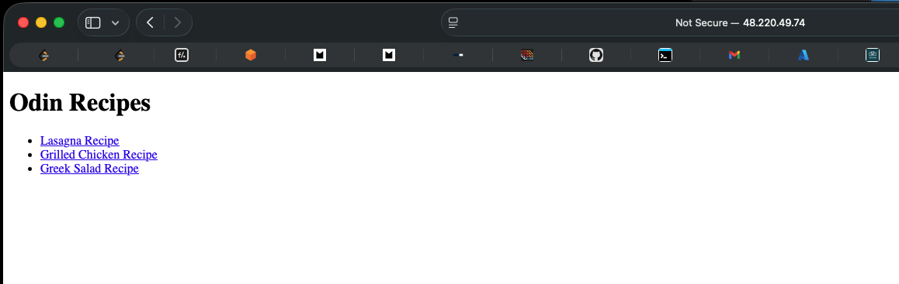

18. Patalpinkite savo pasirinkitą svetainę naudojant Docker. Kūrimui naudokite Dockerfile.

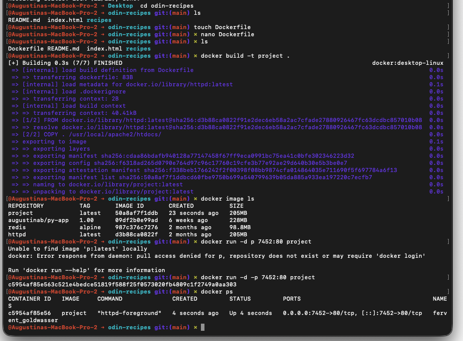

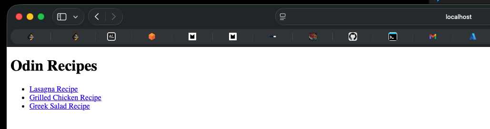


